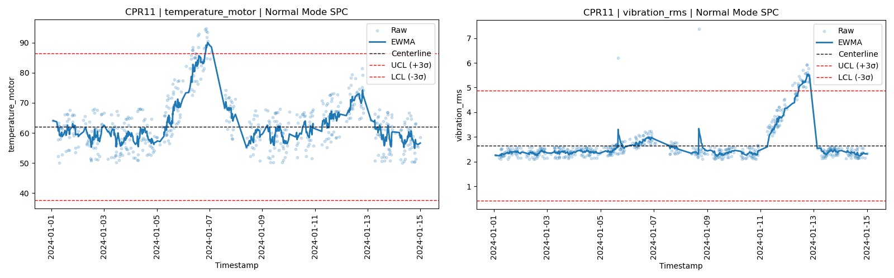

# Deterministic SPC Agent

A reproducible, guardrailed, agent-driven manufacturing analytics system.

---

## Overview

Large manufacturing facilities may contain thousands of equipment fleets, each with hundreds of sensors or other health indicators. The breadth of possible plots and the need for timely analysis limits the usefulness of static dashboards for sustaining engineering activities. Engineers frequently rely on hand-edited SQL filters and ad hoc plotting workflows, which are difficult to standardize and reproduce, as well as time consuming.

**Deterministic SPC Agent** augments and replaces ad hoc plotting workflows with a constrained, reproducible execution pipeline.

Instead of allowing AI models to generate analysis code or write SQL, this system:

- Uses an LLM only to generate a structured plan (JSON)
- Executes only approved SQL templates
- Applies deterministic preprocessing logic
- Generates standardized SPC visualizations
- Exports fully reproducible run artifacts
- Supports plot rework without re-running SQL or preprocessing
- Verifies outputs via schema validation and hashing

**Deterministic SPC Agent** demonstrates how LLMs can safely orchestrate manufacturing analytics without generating SQL, Python, or statistical logic.

All analytics are executed through a guardrailed, registry-driven execution engine with deterministic outputs and full run traceability.

Public predictive manufacturing data from the [Industrial Machine Predictive Maintenance Dataset](https://www.kaggle.com/datasets/tatheerabbas/industrial-machine-predictive-maintenance) was used for this repository.

---

# Documentation

Detailed documentation is available in the `docs/` directory:

- [`architecture.md`](docs/architecture.md)
- [`cli.md`](docs/cli.md)
- [`demo_gallery.md`](docs/demo_gallery.md)
- [`planner_schema.md`](docs/planner_schema.md)
- [`verification.md`](docs/verification.md)

---

# Example Output

**User prompt:**

>CPR11 needed maintenance last week due to motor temperature and again due to vibration. How is it doing now?

**Planner output:**

```
{
  "runs": [
    {
      "run_id": "demo_cpr11_health_check",
      "request_text": "CPR11 needed maintenance last week due to motor temperature and again due to vibration. How is the tool doing now?",
      "jobs": [
        {
          "job_id": "CPR11_temperature_motor",
          "sql_template": "entity_sensor_history",
          "preprocess": "ewma_spc",
          "filters": {
            "entity_group": "CPR",
            "entity": "CPR11",
            "sensor": "temperature_motor",
            "start_ts": null,
            "end_ts": null
          },
          "outputs": {
            "plots": [
              {
                "plot": "spc_time_series",
                "plot_name": "cpr11_temperature_motor_spc.png"
              }
            ]
          }
        }, ...
      ]
    }
  ]
}
```

**Workflow output:**
- Two SPC plots
- Processed datasets
- run.json
- Hash verification output



#### Selected additional examples:

- [The ARM technician will be out next week. Are any vibration PMs coming up?](docs/demo_gallery.md#the-arm-technician-will-be-out-next-week-are-any-vibration-pms-coming-up)

- [PMP09 had temp/current/rpm issues on Jan 12. Show temp trend last 3 days and an OOC summary table last 3 days (temp).](docs/demo_gallery.md#pmp09-had-tempcurrentrpm-issues-on-jan-12-show-temp-trend-last-3-days-and-an-ooc-summary-table-last-3-days-temp)

- [CPR15 had vibration on Jan 9 and pressure instability on Jan 11. Show last 7 days for vibration and
    pressure.](#cpr15-had-vibration-on-jan-9-and-pressure-instability-on-jan-11-show-last-7-days-for-vibration-and-pressure)

- [Replot pressure for just the bad PM cycle. 1/10-1/12.](docs/demo_gallery.md#replot-pressure-for-just-the-bad-pm-cycle-110-112)

- View more examples in the [Demo Gallery](docs/demo_gallery.md)


# Quickstart

Clone repository:

```
git clone https://github.com/michaelm-503/deterministic-spc-agent.git
cd deterministic-spc-agent
```

Create environment:

```
conda env create -f environment.yml
conda activate agentic_mfg
```

Load dataset:

```
notebooks/02_data_setup.ipynb
```

Validate plan:

```
python -m spc_agent validate planner/demo_gallery.json
```

Run demo:

```
python -m spc_agent run planner/demo_gallery.json --run-index 0
```

---

# Architecture

```
User Question
      ↓
LLM Planner: converts request to structured JSON
      ↓
Schema Validation
      ↓
SQL Execution from Template
      ↓
Deterministic Preprocessing
      ↓
Plot/Table Generation
      ↓
Run Artifacts + Hashing + Verification
      ↓↑
Replot (visual-only adjustments)
```

Full architecture documentation: [`architecture.md`](docs/architecture.md)

---

# Roadmap

#### Phase 1 - Proof of Concept Workflow ✅
- Structured data model
- Deterministic preprocessing
- Guardrailed execution

#### Phase 2 – An Execution Framework ✅
- Single-tool and fleet-level analytics workflows
- Plot-level parameter overrides and slicing
- Replot (visual-only rework) mode
- SQL template registry with parameter signatures
- JSON schema validation framework

#### Phase 3 – Production Hardening ✅
- CLI runner
- CI integration
- Automated artifact validation
- Environment pinning

#### Phase 4 – Agentic Front-End
- LLM planner integration
- Guardrail enforcement
- Prompt interpretation layer
- Secure execution interface
- Tool allow-lists

---

# License

MIT License
