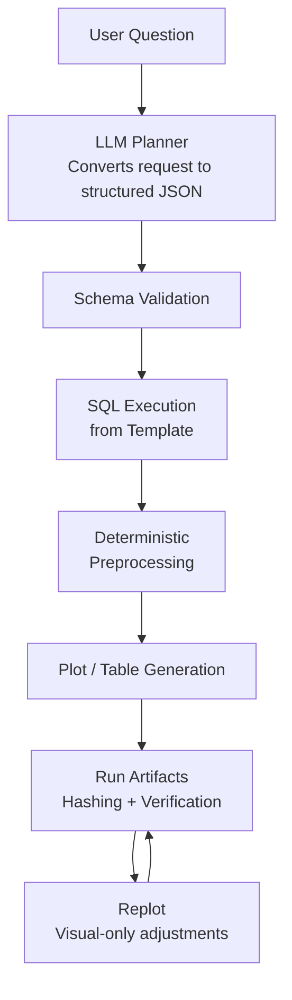

# Deterministic SPC Agent

A guardrailed AI system that converts natural-language requests into **deterministic manufacturing analytics workflows**.

Instead of allowing an LLM to generate executable code, the system uses the LLM only as a **planner** that produces structured execution plans. Those plans are validated and executed by a deterministic analytics engine.

This architecture demonstrates how AI can safely support engineering analysis while preserving **reproducibility, auditability, and deterministic execution**.


[](https://github.com/michaelm-503/deterministic-spc-agent/actions/workflows/ci.yml)


---

# Documentation

Detailed documentation is available in the `docs/` directory:

- [`architecture.md`](docs/architecture.md)
- [`cli.md`](docs/cli.md)
- [`demo_gallery.md`](docs/demo_gallery.md)
- [`developer_guide.md`](docs/developer_guide.md)
- [`planner_schema.md`](docs/planner_schema.md)
- [`verification.md`](docs/verification.md)

---

# Why Does This Exist?

Large manufacturing facilities may contain **thousands of equipment fleets**, each with **hundreds of sensors or health indicators**. Engineers rely on **Statistical Process Control (SPC)** and time-series analysis to detect:

- equipment degradation  
- abnormal process behavior  
- emerging failures  

However, the workflow today is often slow and manual. Engineers frequently rely on hand-edited SQL filters and ad hoc plotting workflows to investigate issues. These workflows can be:

- difficult to standardize  
- hard to reproduce  
- time-consuming during active investigations  

AI systems promise to accelerate this process, but naïve approaches that allow LLMs to generate code introduce serious risks:

- non-reproducible analysis  
- unsafe tool execution  
- unpredictable system behavior  
- lack of auditability  

**Deterministic SPC Agent** demonstrates a safer architecture for AI-assisted engineering analysis.

---

# Demo


A full version of **Determininstic SPC Agent** is available on StreamLit:

[https://deterministic-spc-agent.streamlit.app/](https://deterministic-spc-agent.streamlit.app/).

The demo allows users to submit natural-language prompts and observe the generated execution plans and analytics artifacts.

**Example prompt:**

>CPR11 needed maintenance last week due to motor temperature and again due to vibration. How is it doing now?

**Planner output:**

```
{
  "runs": [
    {
      "run_id": "demo_cpr11_health_check",
      "request_text": "CPR11 needed maintenance last week due to motor temperature and again due to vibration. How is the tool doing now?",
      "jobs": [
        {
          "job_id": "CPR11_temperature_motor",
          "sql_template": "entity_sensor_history",
          "preprocess": "ewma_spc",
          "filters": {
            "entity_group": "CPR",
            "entity": "CPR11",
            "sensor": "temperature_motor",
            "start_ts": null,
            "end_ts": null
          },
          "outputs": {
            "plots": [
              {
                "plot": "spc_time_series",
                "plot_name": "cpr11_temperature_motor_spc.png"
              }
            ]
          }
        }, ...
      ]
    }
  ]
}
```

**Workflow output:**
- Two SPC plots
- Processed datasets 
- `run.json` execution plan  
- Hash verification output


---

# Replot Workflow

Users can modify previous analyses without rerunning the full pipeline.

Prompt:

> Remove the legend from the last plot. Add a boxplot for the last 3 days and an OOC summary.

The system:

1. Resolves the most recent run
2. Reuses existing processed data
3. Regenerates new outputs

This allows interactive analysis while preserving reproducibility.

---

# Key Idea: Deterministic AI

Instead of generating code, the LLM produces **structured execution plans**.

The system then:

1. validates the plan against a schema  
2. restricts execution to approved analytics modules  
3. executes deterministic workflows  
4. records reproducible artifacts  

This design combines:

- **AI usability**
- **engineering reliability**

Importantly, the LLM is responsible only for **interpreting the request**.

Execution itself is deterministic.

Rerunning the same request — even if phrased slightly differently — resolves to the same structured execution plan and deterministic workflow. This ensures reproducibility and builds trust in engineering analysis.

---

# Example Workflow

Prompt:

> Plot 7 days of vibration data for ARM tools.

Execution pipeline:

```
Prompt
→ LLM planner
→ schema validation
→ deterministic execution
→ artifact generation
→ report summarization
```

Each run produces a reproducible artifact directory containing:

- execution plan  
- extracted data  
- processed datasets  
- generated plots  
- summary tables  
- verification hashes  

---

# Architecture



Full architecture documentation:  
[`docs/architecture.md`](docs/architecture.md)

---

# Running Locally

Create the environment:

```bash
conda env create -f environment.yml
conda activate agentic_mfg
```

Launch the Streamlit interface:

```bash
streamlit run streamlit_app.py
```

Example prompt:

```
Plot 7 days of vibration data for ARM tools.
```

---

# Repository Structure

```
spc_agent/
    agent/          # LLM planning + orchestration
runner/             # deterministic execution engine
plots/              # visualization modules
tables/             # summary outputs
preprocess/         # SPC preprocessing
sql/                # query templates

scripts/            # setup pipeline

streamlit_app.py
```

---

# License

MIT License

Dataset included from:

Industrial Machine Predictive Maintenance (syn)  
Author: Tatheer Abbas  
License: CC0 Public Domain  

https://www.kaggle.com/datasets/tatheerabbas/industrial-machine-predictive-maintenance

---

# Author

[Michael C. Moore](https://michaelm-503.github.io)

---
