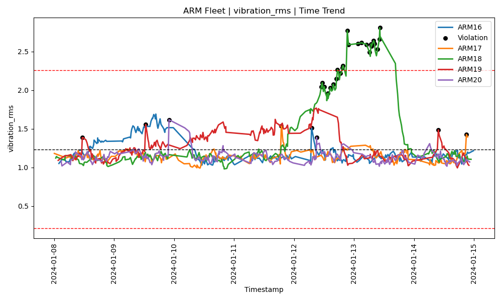
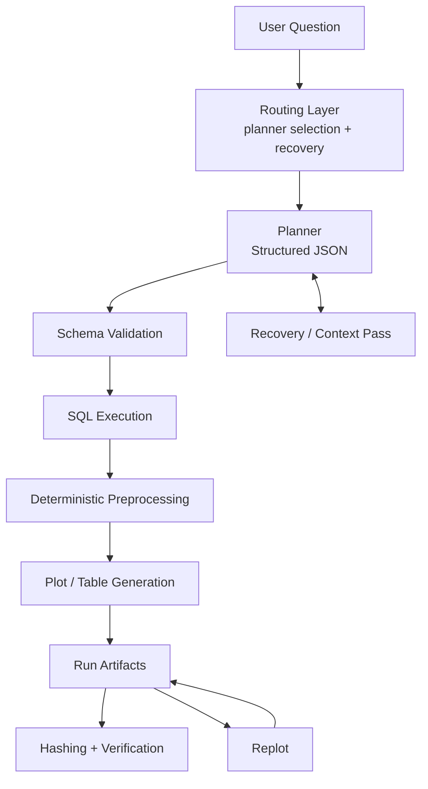

# Deterministic SPC Agent

A guardrailed AI system that converts natural-language requests into **deterministic, reproducible manufacturing analytics workflows**.

Instead of allowing an LLM to generate executable code, the system uses the LLM only as a **planner** that produces structured execution plans. Those plans are validated and executed by a deterministic analytics engine.

This architecture demonstrates how AI can safely support engineering analysis while preserving **reproducibility, auditability, and deterministic execution**.


[](https://github.com/michaelm-503/deterministic-spc-agent/actions/workflows/ci.yml)


---

#  Try it live

[https://deterministic-spc-agent.streamlit.app/](https://deterministic-spc-agent.streamlit.app/)

---

# Why Does This Exist?

Large manufacturing facilities may contain thousands of equipment fleets, each with hundreds of sensors or health indicators. Engineers rely on Statistical Process Control (SPC) and time-series analysis to detect:

- equipment degradation  
- abnormal process behavior  
- emerging failures  

However, the workflow today is often slow and manual. Engineers frequently rely on hand-edited SQL filters and ad hoc plotting workflows to investigate issues. These workflows can be:

- difficult to standardize  
- hard to reproduce  
- time-consuming during active investigations  

AI systems promise to accelerate this process, but naïve approaches that allow LLMs to generate code introduce serious risks:

- non-reproducible analysis  
- unsafe tool execution  
- unpredictable system behavior  
- lack of auditability  

**Deterministic SPC Agent** demonstrates a safer architecture for AI-assisted engineering analysis.

---

# Key idea #1: Deterministic AI

The LLM does **not** generate executable code.

It produces a **structured execution plan**:

1. Schema-validated  
2. Restricted to approved modules  
3. Executed deterministically  
4. Stored as reproducible artifacts  

Rerunning the same request — even if phrased slightly differently — resolves to the same structured execution plan and deterministic workflow. This ensures reproducibility and builds trust in engineering analysis.

---

# Key idea #2: Replot Workflow

Users can modify previous analyses without rerunning the full pipeline.

Prompt:

> Remove the legend from the last plot. Add a boxplot for the last 3 days and an OOC summary.

The system:

1. Resolves the most recent run
2. Reuses existing processed data
3. Regenerates new outputs

This allows interactive analysis while preserving reproducibility.

---

# Key idea #3: Recovery-Based Planning

For conversational follow-ups, the system may use prior context to recover missing intent.

Instead of failing immediately, the planner:
- references previous runs
- infers missing filters or entities
- generates a valid execution plan when possible

This allows natural, iterative workflows while maintaining deterministic execution.

---

# Key idea #4: Planner Modes

The system supports multiple planning strategies:

- **curated** — exact-match prompts map to predefined execution plans  
- **llm** — LLM generates structured plans for novel queries  
- **auto** — attempts curated first, then falls back to LLM  

This design enables:
- deterministic handling of known workflows  
- flexible handling of novel requests  
- graceful degradation when intent is unclear  

---

# Example Workflow

**Example prompt:**

> Plot 7 days of vibration data for ARM tools.

**Planner output:**
```
{
  "run_id": "arm_vibration_7d",
  "request_text": "Plot 7 days of vibration data for ARM tools.",
  "jobs": [
    {
      "job_id": "arm_vibration_7d",
      "sql_template": "fleet_sensor_history",
      "preprocess": "ewma_spc",
      "filters": {
        "entity_group": "ARM",
        "entity": null,
        "sensor": "vibration_rms",
        "start_ts": "2024-01-08T00:00:00",
        "end_ts": "2024-01-15T00:00:00"
      },
      "outputs": {
        "plots": [
          {
            "plot": "fleet_time_trend",
            "plot_name": "arm_vibration_7d.png"
          }
        ]
      }
    }
  ]
}
```

**Workflow output:**



Stored artifacts:
- Generated outputs (plots & summary tables)
- Processed datasets  
- `run.json` execution plan  
- Hash manifest (`hashes.json`) for reproducibility and verification  


---

# Architecture

The system includes a recovery loop that uses prior run context to resolve incomplete or ambiguous follow-up requests before failing.



Full architecture documentation:  
[`docs/architecture.md`](docs/architecture.md)

---

# CLI Usage

The system can also be used programmatically:
```
python -m spc_agent setup
python -m spc_agent ask "Plot 7 days of vibration data for ARM tools."
```
---

# Documentation

Detailed documentation is available in the `docs/` directory:

- [`architecture.md`](docs/architecture.md)
- [`cli.md`](docs/cli.md)
- [`demo_gallery.md`](docs/demo_gallery.md)
- [`developer_guide.md`](docs/developer_guide.md)
- [`planner_schema.md`](docs/planner_schema.md)
- [`verification.md`](docs/verification.md)

---

# License

MIT License

Dataset included from:

Industrial Machine Predictive Maintenance (syn)  
Author: Tatheer Abbas  
License: CC0 Public Domain  

https://www.kaggle.com/datasets/tatheerabbas/industrial-machine-predictive-maintenance

---

# Author

[Michael C. Moore](https://michaelm-503.github.io)

---
