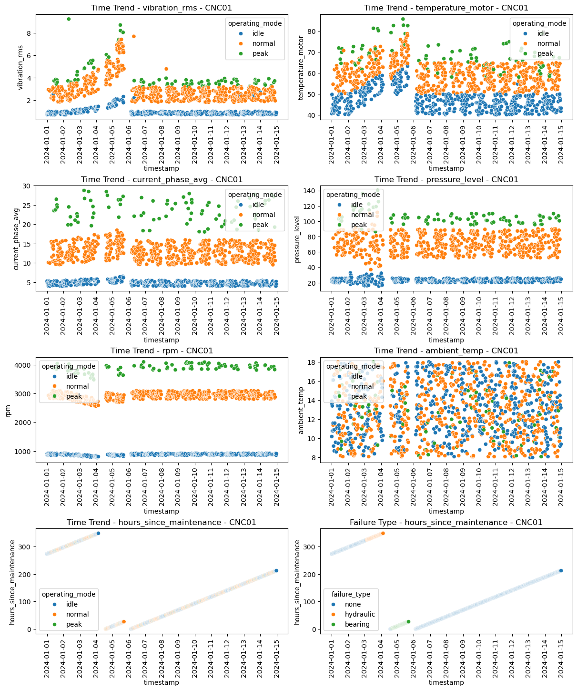
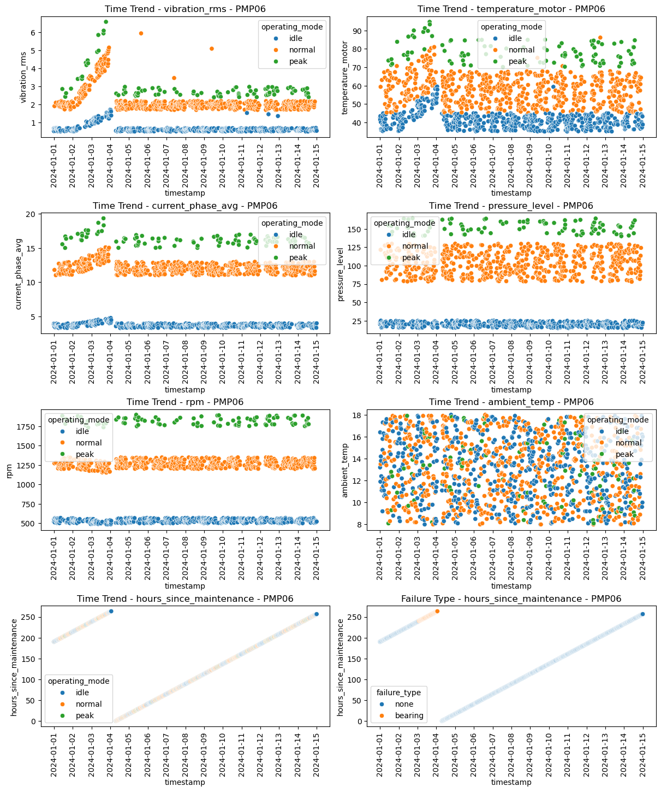
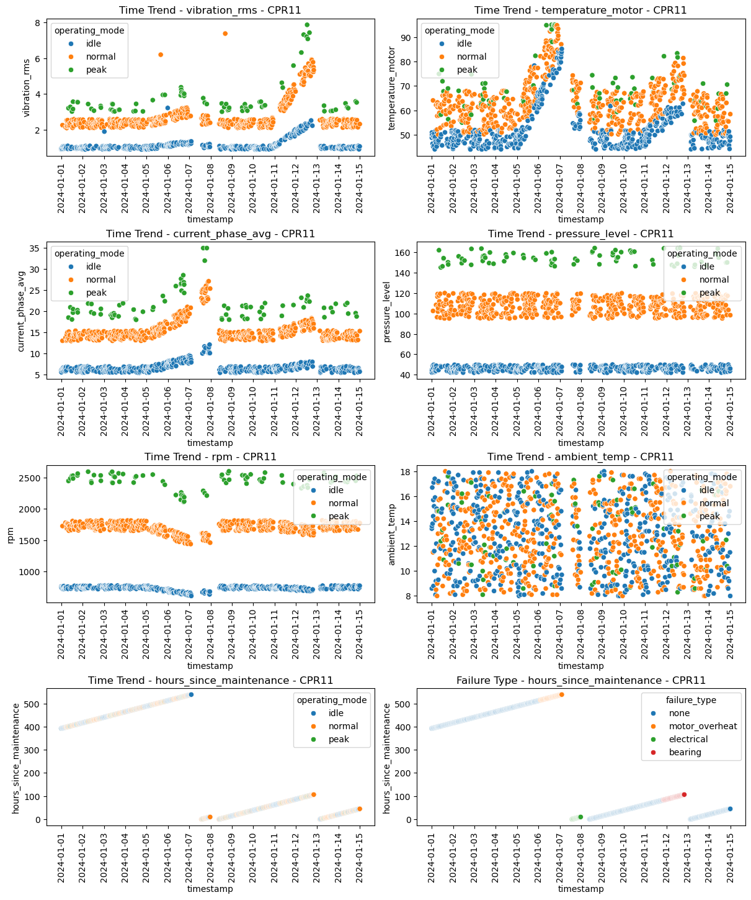
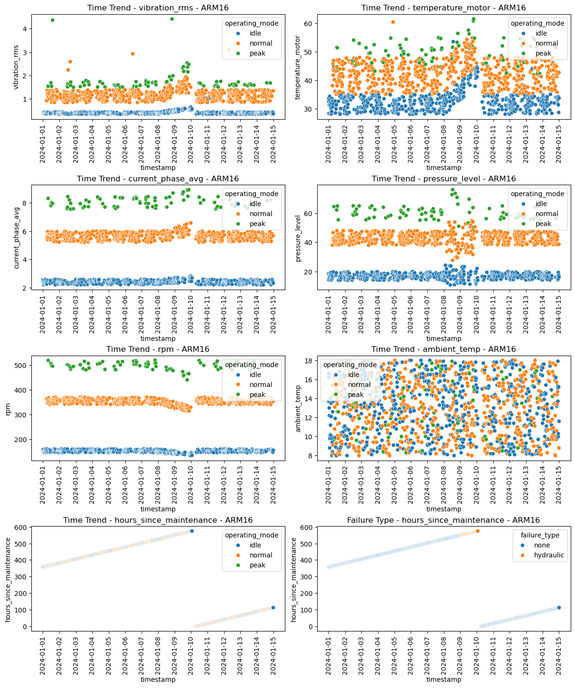
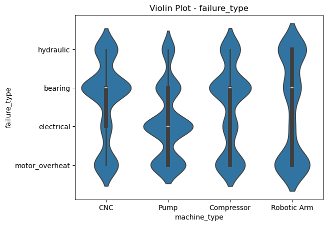

## About this dataset

This artifical [dataset](README.md#license) covers 14 days for a fleet of four equipment types with five tools each. 

| Entity Group | Description | Entities |
|--------------|-------------|----------|
| CNC          | CNC         | CNC01<br />CNC02<br />CNC03<br />CNC04<br />CNC05   |
| PMP          | Pump        | PMP06<br />PMP07<br />PMP08<br />PMP09<br />PMP10   |
| CPR          | Compressor  | CPR11<br />CPR12<br />CPR13<br />CPR14<br />CNC15   |
| ARM          | Robotic Arm | ARM16<br />ARM17<br />ARM18<br />ARM19<br />ARM20   |

Each entity has six defined sensors:
```
- vibration_rms
- temperature_motor
- current_phase_avg
- pressure_level
- rpm
- ambient_temp
```

**Entity Group and Sensor are key parameters that define each SPC chart.**

The sensor data includes a context column for operating_mode: idle, normal, or peak. Only the normal dataset was included for the SPC dataset.

When a sensor drifts off target, the equipment goes down for maintenance to reset the tool to baseline. Sometimes, the maintenance fails and has to be repeated.

The dataset includes additional columns that are not yet supported by the SPC Agent (but planned for future extensions):
- `hours_since_maintenance`: tracks maintenance lifetime, resets after each maintenance
- `failure_type`: stores root cause attribution for each maintenance event There is also an informational column failure_type.

---
### CNC Sample Data



---

### PMP Sample Data


---

### CPR Sample Data


---

### ARM Sample Data


---

### Failure Types by Entity Group
