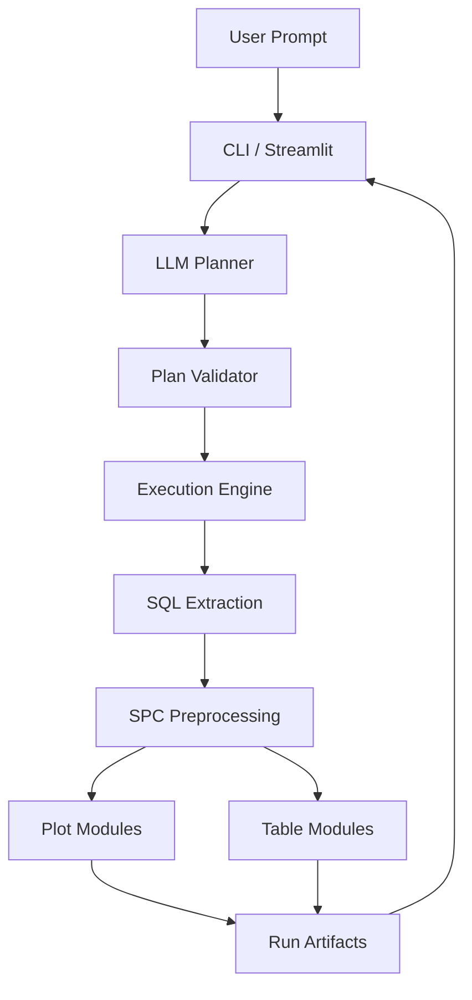
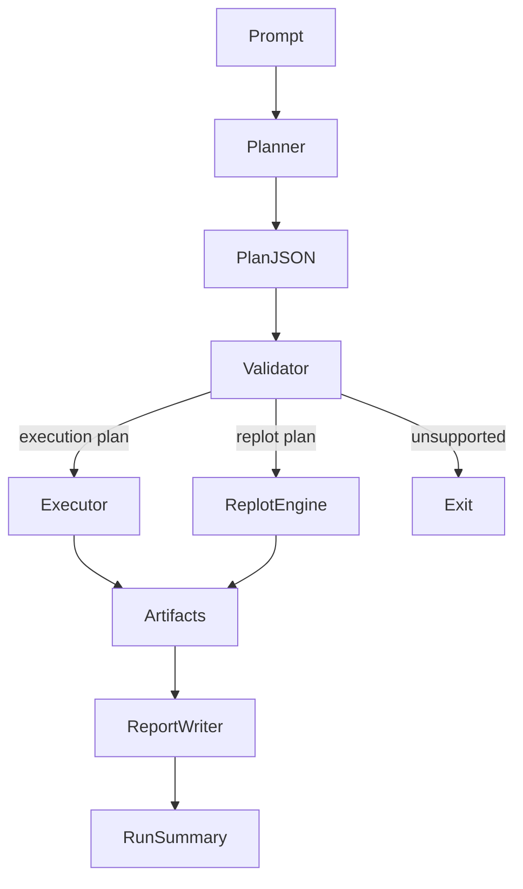
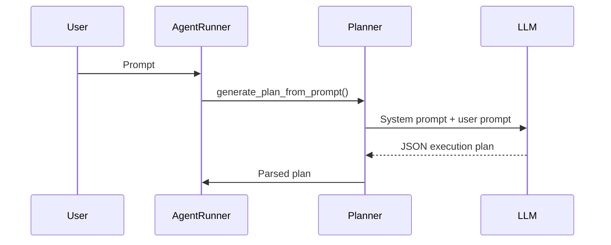
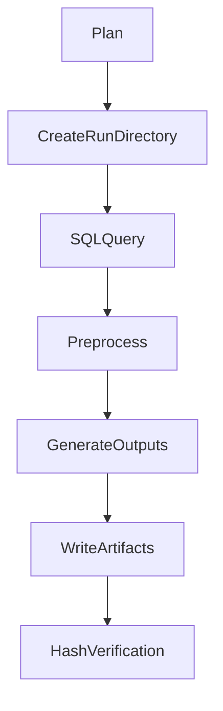
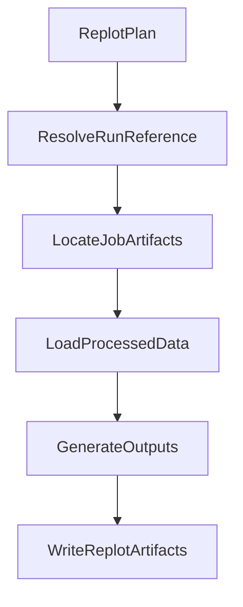

# Deterministic SPC Agent  
## System Architecture

Author: Michael Moore  
Project: Deterministic SPC Agent  
Current Architecture: Phase 4 (Agentic Front-End + Interactive Demo)

---

# 1. Overview

The Deterministic SPC Agent is a guardrailed AI system that converts natural-language requests into deterministic analytics workflows for manufacturing process monitoring.

The system allows users to request SPC analysis using plain language while ensuring that all execution remains deterministic, auditable, and restricted to pre-approved analytics modules.

Instead of allowing an LLM to generate code directly, the architecture uses the LLM only as a **planner** that generates structured JSON execution plans. These plans are validated and then executed by a deterministic analytics engine.

This design provides the usability benefits of AI while maintaining the reliability and safety required for engineering analytics systems.

---

# 2. Core Design Principles

## Deterministic Execution

LLMs do not generate executable code.  
They generate structured **execution plans** that reference pre-approved modules.

All analytics execution occurs through deterministic Python functions.

---

## Guardrailed AI Planning

LLM output is constrained by:

- a strict JSON schema
- tool allow-lists
- validation checks

Invalid plans cannot reach execution.

---

## Artifact-Based Reproducibility

Every execution produces a fully reproducible artifact directory containing:

- execution plan
- intermediate datasets
- generated plots
- summary tables
- verification hashes

---

## Separation of Concerns

The system separates responsibilities across four layers:

| Layer | Responsibility |
|------|------|
| Interface | CLI / Streamlit user interface |
| Planning | LLM prompt interpretation |
| Validation | Schema and guardrail enforcement |
| Execution | Deterministic analytics workflows |

---

# 3. High-Level System Architecture



---

# 4. Repository Structure

The project is organized by functional subsystem.

```
deterministic-spc-agent

spc_agent/
    agent/
        agent_runner.py
        planner.py
        planner_llm.py
        planner_stub.py
        planner_prompt.py
        report_writer.py

runner/
    run_one_run.py
    replot_run.py
    validate_plan.py
    run_lookup.py

sql/
preprocess/
plots/
tables/

scripts/
    setup_data.py
    build_planner_catalog.py

planner/
    demo_gallery.json
    metadata/catalog.json

streamlit_app.py
environment.yml
```

---

# 5. Execution Workflow

The core workflow converts a prompt into artifacts.



---

# 6. Planning System

The planning system translates natural language into structured execution plans.

Two planner backends exist.

| Planner | Purpose |
|------|------|
LLM Planner | Natural-language interpretation |
Stub Planner | Deterministic demo workflows |

---

## Planner Workflow



---

# 7. Execution Engine

The execution engine runs deterministic analytics workflows.

Each job follows a fixed pipeline:

```
SQL extraction
→ preprocessing
→ output generation
```

---

## Execution Flow



---

# 8. Job Structure

Each job describes a single analytics workflow.

Example job structure:

```
{
  "job_id": "cpr11_vibration_status",
  "sql_template": "entity_sensor_history",
  "preprocess": "ewma_spc",
  "filters": {
    "entity_group": "CPR",
    "entity": "CPR11",
    "sensor": "vibration_rms"
  },
  "outputs": {
    "plots": [
      {
        "plot": "spc_time_series",
        "plot_name": "cpr11_vibration.png"
      }
    ]
  }
}
```

---

# 9. Replot System

Replot allows users to modify outputs from a previous run without recomputing upstream steps.

Replots reuse stored processed datasets.

```
processed_data.csv
```

Replot artifacts are stored under:

```
job/replots/<timestamp>/
```

---

## Replot Workflow



---

# 10. Run Resolution System

Replot plans may reference previous runs semantically.

Supported references:

```
run_ref = "latest"
```

The system resolves this to the most recent run directory under:

```
runs/
```

The run lookup module handles semantic resolution.

---

# 11. Artifact Model

Each run produces a fully reproducible artifact directory.

```
runs/
  2026-03-15T18-22-44/

      run.json
      run_summary.md
      hash_manifest.json

      job_1/
          extracted_data.csv
          processed_data.csv
          plot.png
          summary.csv
```

Artifacts enable:

- reproducibility
- auditability
- experiment traceability

---

# 12. Reporting System

After execution, the system generates a Markdown report summarizing results.

The report includes:

- plots
- tables
- execution metadata
- artifact references

The Streamlit interface renders artifacts directly from the run directory.

---

# 13. Setup Pipeline

Initial setup prepares the analytics environment.

The setup scripts perform two tasks:

### Data initialization

```
scripts/setup_data.py
```

Creates:

```
data/mfg.duckdb
```

from the included dataset.

---

### Planner catalog generation

```
scripts/build_planner_catalog.py
```

Generates the allow-list catalog used by the planner:

```
planner/metadata/catalog.json
```

---

# 14. User Interfaces

The system supports two user interfaces.

---

## CLI Interface

Example:

```
python cli.py run "Plot 7 days of vibration data for ARM tools"
```

---

## Streamlit Interface

The Streamlit application provides an interactive demo environment.

Capabilities include:

- prompt entry
- artifact visualization
- execution history
- planner diagnostics

---

# 15. Safety Model

The architecture prevents unsafe execution through several guardrails.

| Mechanism | Purpose |
|------|------|
Tool allow-lists | Prevent unapproved modules |
Schema validation | Ensure correct plan structure |
SQL templates | Prevent arbitrary SQL |
Deterministic modules | Prevent arbitrary Python |

---

# 16. Deterministic AI Architecture

The system demonstrates a hybrid AI architecture.

| Component | Role |
|------|------|
LLM | planning |
Validator | guardrails |
Execution engine | deterministic analytics |

This pattern allows AI to interpret requests without allowing it to control execution.

---

# 17. Summary

The Deterministic SPC Agent demonstrates how large language models can be safely integrated into engineering analytics workflows.

By combining:

- natural language planning
- strict validation
- deterministic execution

the system enables powerful analytics capabilities while preserving safety, reproducibility, and auditability.
