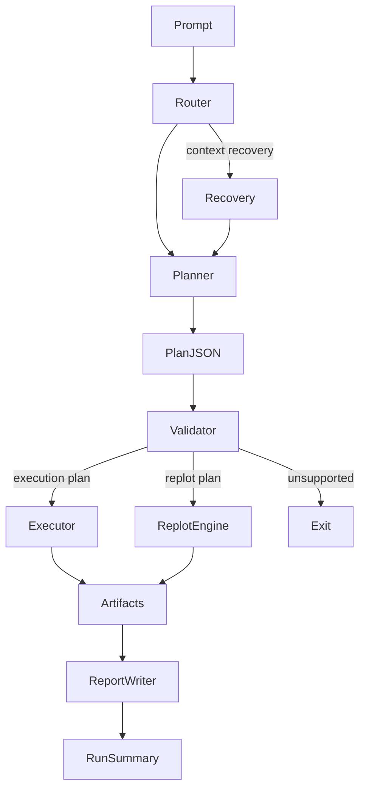
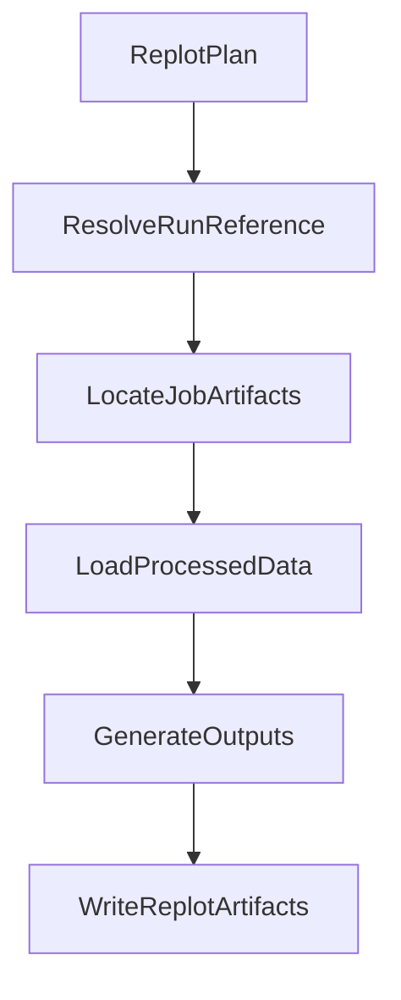

# Deterministic SPC Agent
## System Architecture


# 1. Conceptual System Architecture

```mermaid
flowchart TD

A[User Question]

B[Routing Layer<br/>planner selection + recovery]

C[Planner<br/>Structured JSON]

D[Schema Validation]

E[SQL Execution]

F[Deterministic Preprocessing]

G[Plot / Table Generation]

H[Run Artifacts]

I[Recovery / Context Pass]

J[Replot]

K[Hash Manifest + Verification (optional)]

L[Unsupported Request]

A --> B
B --> C
C --> D
D --> E
E --> F
F --> G
G --> H
H --> K

C <--> I
H --> J
J --> H
J --> K

C --> L
I --> L
```

---

## User Question

The system supports two primary interfaces:

- **CLI** — programmatic execution (`spc_agent ask`)
- **Streamlit** — interactive UI and visualization

Both interfaces route into the same planning and execution pipeline.

Streamlit servers can run locally or [accessible in the cloud](https://deterministic-spc-agent.streamlit.app).

---

## Routing Layer

The routing layer determines how a request is planned.

Planner selection modes:

- **curated** — exact-match prompts → predefined execution plans  
- **llm** — LLM generates structured plans for novel queries  
- **auto** — attempts curated first, then falls back to the LLM planner  

### Recovery routing

For conversational follow-ups, rework requests, or unclear requests, the system may invoke a **recovery pass**:

- re-runs the planner with the most recent successful run context  
- infers missing filters or entities to make a valid execution plan  
- links replot request to existing artifacts  
- attempts to escalate an invalid replot request to a valid execution plan  
- returns a safe exit for unsupported or undetermined requests  
- capped at one recovery attempt  

This allows iterative workflows without sacrificing determinism.

---

## Planner

Planner implementations:

- `planner_curated.py`
- `planner.py` (LLM planner)
- `planner_prompt.py`

The planner:

- converts natural language → structured JSON  
- does **not** execute code  
- is constrained by the planner schema, registry allow-lists, and validation checks  

---

## Validation and Execution

The system converts prompts into validated execution plans.

### Execution-time control flow



---

## Deterministic Processing

The execution engine runs fixed analytics workflows.

Each job follows:

SQL extraction → Preprocessing → Output generation

Execution modules must be registered:

- SQL templates (`sql/`)
- preprocess (`preprocess/`)
- plots (`plots/`)
- tables (`tables/`)

This prevents arbitrary code execution.

---

## Run Artifacts

Each execution run produces a reproducible artifact directory:

runs/
  2026-03-15T18-22-44/

      run.json
      run_summary.md
      hashes.json
      planner_raw.txt
      planner_plan.json

      job_1/
          extracted_data.csv
          processed_data.csv
          plot.png
          summary.csv

Artifacts enable:

- reproducibility  
- auditability  
- experiment traceability  

After execution:

- run_summary.md is generated  
- embeds plots, tables, metadata  
- Streamlit renders directly from artifacts  

Replot workflows generate output artifacts under the referenced job’s replots/ directory and do not create a new run_summary.md.

---

## Recovery

The system supports a recovery sentinel for ambiguous follow-up requests.

The recovery sentinel is triggered when the planner cannot resolve a complete execution plan from a single prompt. Scenarios include (but are not limited to):

- a replot request (whether valid or not)
- implied information (as a result of a conversational prompt)
- attempting unsupported requests

This sentinel does **not** mean “final replot plan.”

Instead, it tells the backend to:

1. load the most recent successful run context
2. re-invoke the planner with enriched input
3. resolve the request into one of:
   - a valid execution plan
   - a valid replot plan
   - an unsupported response

-
### When recovery is used

Recovery is typically used for prompts such as:

- “replot that”
- “remove the legend”
- “now show me vibration data”
- “now show me the last 14 days”
- “change it to ARM”

-
### Execution vs replot boundary

After recovery context is added:

- use **replot** if the request can be satisfied by reusing the original processed dataset
- use **execution** if the request requires:
  - a different sensor
  - a different entity or entity_group
  - a wider SQL extraction window
  - a new extraction workflow

If the request still cannot be safely resolved, return an unsupported response.

-
### Example: Recovery Escalation to Execution

**User prompt:**

>”now show vibration data instead"

**Initial sentinel:**
```
{
  "mode": "replot",
  "run_ref": "latest"
}
```
**Additional context provided:**

- previous run was temperature sensor

**After recovery:**

- resolved to execution plan with updated sensor = vibration_rms
- previous run is used to complete missing information for execution plan: processing workflow, entity & timeframe filters, output workflow and params.

**Reason:**

- Changing sensor requires new SQL extraction, so replot is not valid.

---

## Replot

Replot modifies outputs without recomputing upstream steps.

Replots:

- do **not** rerun SQL extraction
- do **not** rerun preprocessing
- reuse prior `processed_data.csv` artifacts
- write new outputs under:

Replot artifacts stored under:

`job/replots/<timestamp>/`

-
### Execution vs Replot

- Execution plans perform SQL extraction, preprocessing, and output generation.  
- Replot plans reuse previously generated processed artifacts and regenerate outputs only.  
- If a follow-up request requires a different sensor, entity, or wider SQL time window, recovery may resolve it into a new execution plan instead of a replot.  

-
### Replot Workflow



---

## Hashing + Verification

Hashing occurs after all artifacts are written, including:

- run.json  
- run_summary.md  
- planner debug artifacts  
- job artifacts  

This produces:

hashes.json

-
### Verification

Verification is performed separately:

spc_agent verify <run_dir>

Ensures:

- artifact integrity  
- reproducibility checks  
- detection of post-run modification  

---

## Unsupported Requests

Requests may be marked unsupported if:

- schema cannot be satisfied  
- required parameters cannot be inferred  
- recovery fails to resolve ambiguity  

Unsupported responses:

- do not execute  
- do not produce artifacts  
- preserve system safety  

---

# 2. Core Design Principles


## Deterministic Execution

LLMs do not generate executable code.  

They produce structured execution plans referencing pre-approved modules.

All execution is deterministic Python.

---

## Guardrailed AI Planning

LLM output is constrained by:

- strict JSON schema  
- tool allow-lists  
- validation checks  

Invalid plans cannot reach execution.

---

## Artifact-Based Reproducibility

Every run produces:

- execution plan  
- intermediate datasets  
- outputs  
- hash manifest  

Artifacts are the system’s source of truth.

---

## Separation of Concerns

Interface → Planning → Validation → Execution

---

## Current Scope and Limitations

Phase 4 intentionally limits the system to:

- approved SQL templates and deterministic analytics modules  
- recovery using the most recent successful run context  
- replot workflows that reuse existing processed artifacts  

---

## Planner and Executor Contract

The planner produces structured JSON plans.  
The executor runs only registered deterministic modules.  
Validation enforces the boundary.

---

# 3. Repository Structure

```
deterministic-spc-agent

spc_agent/
    agent/
        agent_runner.py
        planner.py
        planner_curated.py
        planner_prompt.py
        report_writer.py

runner/
    run_one_run.py
    replot_run.py
    validate_plan.py
    run_lookup.py

sql/
preprocess/
plots/
tables/

scripts/
    setup_data.py
    build_planner_catalog.py

planner/
    demo_gallery.json
    metadata/catalog.json

data/
	raw/
		predictive_maintenance_v3.csv.zip       # Credit: Tatheer Abbas

streamlit_app.py
environment.yml
requirements.txt    # deployment-only, used on the Streamlit branch
```

---

# 4. Setup Pipeline

Initial setup prepares the analytics environment.

CLI:
```
python -m spc_agent setup
```

Streamlit:
Setup runs automatically if initialization check fails.
