# Deterministic SPC Agent -- Demo Gallery

This gallery presents 13 structured demo scenarios showcasing
deterministic SPC workflows, fleet health analysis, maintenance-aware
investigation, and replot capabilities.

------------------------------------------------------------------------

## Table of Contents

-   [CPR11 needed maintenance last week due to motor temperature and
    again due to vibration. How is the tool doing
    now?](#cpr11-needed-maintenance-last-week-due-to-motor-temperature-and-again-due-to-vibration-how-is-the-tool-doing-now)
-   [Compare RPM trends for CNC03 and
    CNC04.](#compare-rpm-trends-for-cnc03-and-cnc04)
-   [The ARM technician will be out next week. Are any vibration PMs
    coming
    up?](#the-arm-technician-will-be-out-next-week-are-any-vibration-pms-coming-up)
-   [PMP06 had a vibration event around Jan 3. Show vibration trend ±3
    days around that
    date.](#pmp06-had-a-vibration-event-around-jan-3-show-vibration-trend-3-days-around-that-date)
-   [PMP07 vibration around Jan 7. Plot ±3 days and hide the
    legend.](#pmp07-vibration-around-jan-7-plot-3-days-and-hide-the-legend)
-   [PMP07 had current/rpm issues around Jan 2. Show both current and
    rpm ±2
    days.](#pmp07-had-currentrpm-issues-around-jan-2-show-both-current-and-rpm-2-days)
-   [PMP09 had temp/current/rpm issues on Jan 12. Show temp trend last 3
    days and an OOC summary table last 3 days
    (temp).](#pmp09-had-tempcurrentrpm-issues-on-jan-12-show-temp-trend-last-3-days-and-an-ooc-summary-table-last-3-days-temp)
-   [ARM17 vibration around Jan 3. Compare ARM fleet vibration last 7
    days, then ARM17 ±3 days around Jan
    3.](#arm17-vibration-around-jan-3-compare-arm-fleet-vibration-last-7-days-then-arm17-3-days-around-jan-3)
-   [ARM20 had current/rpm/temp issues on Jan 6. Show last 5 days for
    current, rpm, and
    temp.](#arm20-had-currentrpmtemp-issues-on-jan-6-show-last-5-days-for-current-rpm-and-temp)
-   [ARM19 issues on Jan 11 then pressure instability on Jan 12. Show
    pressure and temp from Jan 10--Jan
    13.](#arm19-issues-on-jan-11-then-pressure-instability-on-jan-12-show-pressure-and-temp-from-jan-10jan-13)
-   [CPR14 had pressure instability around Jan 9. Show pressure ±2 days,
    EWMA
    only.](#cpr14-had-pressure-instability-around-jan-9-show-pressure-2-days-ewma-only)
-   [CPR15 had vibration on Jan 9 and pressure instability on Jan 11.
    Show last 7 days for vibration and
    pressure.](#cpr15-had-vibration-on-jan-9-and-pressure-instability-on-jan-11-show-last-7-days-for-vibration-and-pressure)
-   [After CPR15 post-PM pressure instability, show CPR fleet pressure
    last 3 days and CPR15
    separately.](#after-cpr15-post-pm-pressure-instability-show-cpr-fleet-pressure-last-3-days-and-cpr15-separately)
-   [Replot pressure for just the bad PM cycle. 1/10-1/12.](#replot-pressure-for-just-the-bad-pm-cycle-110-112)


------------------------------------------------------------------------

# CPR11 needed maintenance last week due to motor temperature and again due to vibration. How is the tool doing now?

*Run ID: `demo_cpr11_health_check`*

## JSON Plan

``` json
{
  "run_id": "demo_cpr11_health_check",
  "request_text": "CPR11 needed maintenance last week due to motor temperature and again due to vibration. How is the tool doing now?",
  "jobs": [
    {
      "job_id": "CPR11_temperature_motor",
      "sql_template": "entity_sensor_history",
      "preprocess": "ewma_spc",
      "filters": {
        "entity_group": "CPR",
        "entity": "CPR11",
        "sensor": "temperature_motor",
        "start_ts": null,
        "end_ts": null
      },
      "outputs": {
        "plots": [
          {
            "plot": "spc_time_series",
            "plot_name": "cpr11_temperature_motor_spc.png"
          }
        ]
      }
    },
    {
      "job_id": "CPR11_vibration_rms",
      "sql_template": "entity_sensor_history",
      "preprocess": "ewma_spc",
      "filters": {
        "entity_group": "CPR",
        "entity": "CPR11",
        "sensor": "vibration_rms",
        "start_ts": null,
        "end_ts": null
      },
      "outputs": {
        "plots": [
          {
            "plot": "spc_time_series",
            "plot_name": "cpr11_vibration_rms_spc.png"
          }
        ]
      }
    }
  ]
}
```

## Output Artifacts

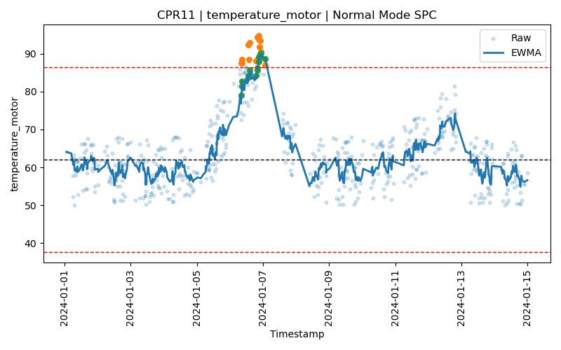

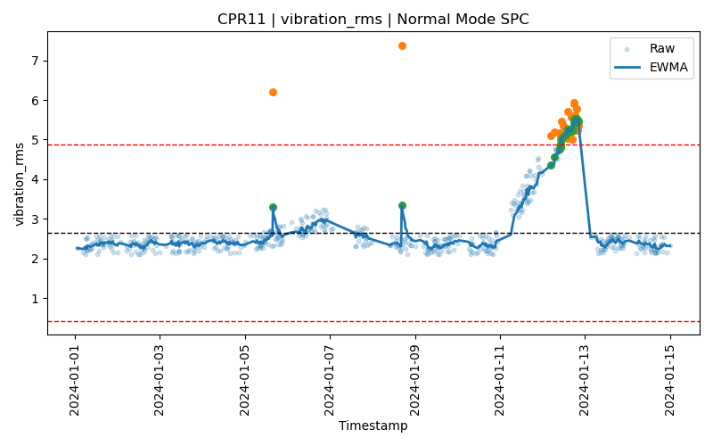

------------------------------------------------------------------------

# Compare RPM trends for CNC03 and CNC04.

*Run ID: `demo_cnc_rpm_comparison`*

## JSON Plan

``` json
{
  "run_id": "demo_cnc_rpm_comparison",
  "request_text": "Compare RPM trends for CNC03 and CNC04.",
  "jobs": [
    {
      "job_id": "CNC_rpm",
      "sql_template": "fleet_sensor_history",
      "preprocess": "ewma_spc",
      "filters": {
        "entity_group": "CNC",
        "entity": null,
        "sensor": "rpm",
        "start_ts": null,
        "end_ts": null
      },
      "params": {},
      "outputs": {
        "plots": [
          {
            "plot": "fleet_time_trend",
            "plot_name": "cnc_fleet_rpm_time_trend_CNC03_CNC04.png",
            "params": {
              "entities": [
                "CNC03",
                "CNC04"
              ]
            }
          }
        ]
      }
    }
  ]
}
```

## Output Artifacts

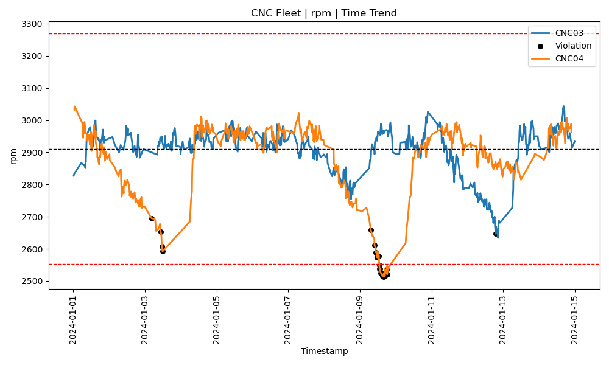

------------------------------------------------------------------------

# The ARM technician will be out next week. Are any vibration PMs coming up?

*Run ID: `demo_arm_vibration`*

## JSON Plan

``` json
{
  "run_id": "demo_arm_vibration",
  "request_text": "The ARM technician will be out next week. Are any vibration PMs coming up?",
  "jobs": [
    {
      "job_id": "arm_fleet_vibration_health_check",
      "sql_template": "fleet_sensor_history",
      "preprocess": "ewma_spc",
      "filters": {
        "entity_group": "ARM",
        "entity": null,
        "sensor": "vibration_rms",
        "start_ts": null,
        "end_ts": null
      },
      "params": {},
      "outputs": {
        "plots": [
          {
            "plot": "fleet_time_trend",
            "plot_name": "arm_fleet_vibration_time_trend.png"
          },
          {
            "plot": "fleet_boxplot",
            "plot_name": "arm_fleet_vibration_boxplot.png",
            "params": {
              "window_days": 3
            }
          }
        ],
        "tables": [
          {
            "table": "fleet_ooc_summary",
            "table_name": "arm_fleet_vibration_OOCs_last_1_day.csv",
            "params": {
              "window_days": 1
            }
          }
        ]
      }
    }
  ]
}
```

## Output Artifacts

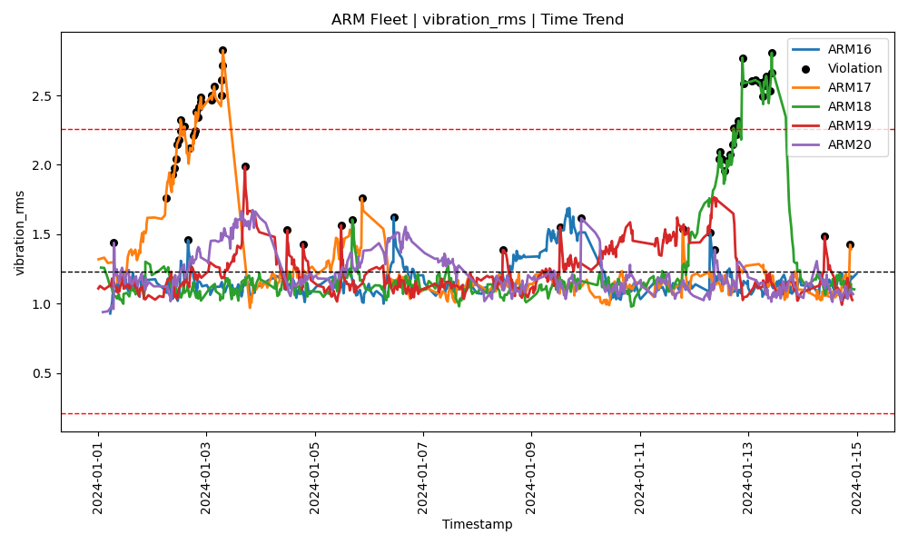


|    | entity_group   | sensor        | entity   |   total_points |   ooc_points |   percent_ooc |
|---:|:---------------|:--------------|:---------|---------------:|-------------:|--------------:|
|  0 | ARM            | vibration_rms | ARM16    |             43 |            0 |       0       |
|  1 | ARM            | vibration_rms | ARM17    |             42 |            1 |       2.38095 |
|  2 | ARM            | vibration_rms | ARM18    |             39 |            0 |       0       |
|  3 | ARM            | vibration_rms | ARM19    |             35 |            1 |       2.85714 |
|  4 | ARM            | vibration_rms | ARM20    |             46 |            0 |       0       |

------------------------------------------------------------------------

# PMP06 had a vibration event around Jan 3. Show vibration trend ±3 days around that date.

*Run ID: `demo_pmp06_vibration_pm_window_jan03`*

## JSON Plan

``` json
{
  "run_id": "demo_pmp06_vibration_pm_window_jan03",
  "request_text": "PMP06 had a vibration event around Jan 3. Show vibration trend \u00b13 days around that date.",
  "jobs": [
    {
      "job_id": "pmp06_vibration_jan03_pm_window",
      "sql_template": "entity_sensor_history",
      "preprocess": "ewma_spc",
      "filters": {
        "entity_group": "PMP",
        "entity": "PMP06",
        "sensor": "vibration_rms",
        "start_ts": null,
        "end_ts": null
      },
      "outputs": {
        "plots": [
          {
            "plot": "spc_time_series",
            "plot_name": "pmp06_vibration_pm_window_jan03.png",
            "params": {
              "start_ts": "2024-01-01",
              "end_ts": "2024-01-06",
              "show_raw": true,
              "legend": true
            }
          }
        ]
      }
    }
  ]
}
```

## Output Artifacts

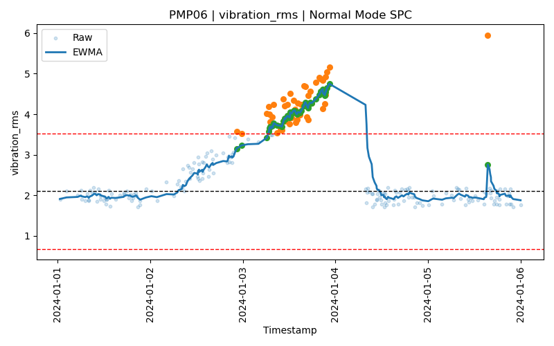

------------------------------------------------------------------------

# PMP07 vibration around Jan 7. Plot ±3 days and hide the legend.

*Run ID: `demo_pmp07_vibration_pm_window_jan07_hide_legend`*

## JSON Plan

``` json
{
  "run_id": "demo_pmp07_vibration_pm_window_jan07_hide_legend",
  "request_text": "PMP07 vibration around Jan 7. Plot \u00b13 days and hide the legend.",
  "jobs": [
    {
      "job_id": "pmp07_vibration_jan07_pm_window",
      "sql_template": "entity_sensor_history",
      "preprocess": "ewma_spc",
      "filters": {
        "entity_group": "PMP",
        "entity": "PMP07",
        "sensor": "vibration_rms",
        "start_ts": null,
        "end_ts": null
      },
      "outputs": {
        "plots": [
          {
            "plot": "spc_time_series",
            "plot_name": "pmp07_vibration_pm_window_jan07.png",
            "params": {
              "start_ts": "2024-01-04",
              "end_ts": "2024-01-10",
              "show_raw": true,
              "legend": false
            }
          }
        ]
      }
    }
  ]
}
```

## Output Artifacts

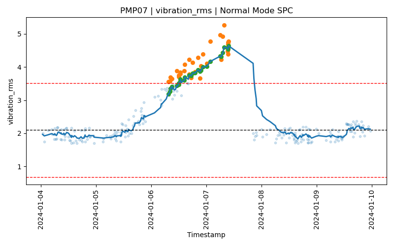

------------------------------------------------------------------------

# PMP07 had current/rpm issues around Jan 2. Show both current and rpm ±2 days.

*Run ID: `demo_pmp07_current_rpm_pm_window_jan02`*

## JSON Plan

``` json
{
  "run_id": "demo_pmp07_current_rpm_pm_window_jan02",
  "request_text": "PMP07 had current/rpm issues around Jan 2. Show both current and rpm \u00b12 days.",
  "jobs": [
    {
      "job_id": "pmp07_current_jan02",
      "sql_template": "entity_sensor_history",
      "preprocess": "ewma_spc",
      "filters": {
        "entity_group": "PMP",
        "entity": "PMP07",
        "sensor": "current_phase_avg",
        "start_ts": null,
        "end_ts": null
      },
      "outputs": {
        "plots": [
          {
            "plot": "spc_time_series",
            "plot_name": "pmp07_current_jan02.png",
            "params": {
              "start_ts": "2023-12-31",
              "end_ts": "2024-01-04",
              "show_raw": true
            }
          }
        ]
      }
    },
    {
      "job_id": "pmp07_rpm_jan02",
      "sql_template": "entity_sensor_history",
      "preprocess": "ewma_spc",
      "filters": {
        "entity_group": "PMP",
        "entity": "PMP07",
        "sensor": "rpm",
        "start_ts": null,
        "end_ts": null
      },
      "outputs": {
        "plots": [
          {
            "plot": "spc_time_series",
            "plot_name": "pmp07_rpm_jan02.png",
            "params": {
              "start_ts": "2023-12-31",
              "end_ts": "2024-01-04",
              "show_raw": true
            }
          }
        ]
      }
    }
  ]
}
```

## Output Artifacts

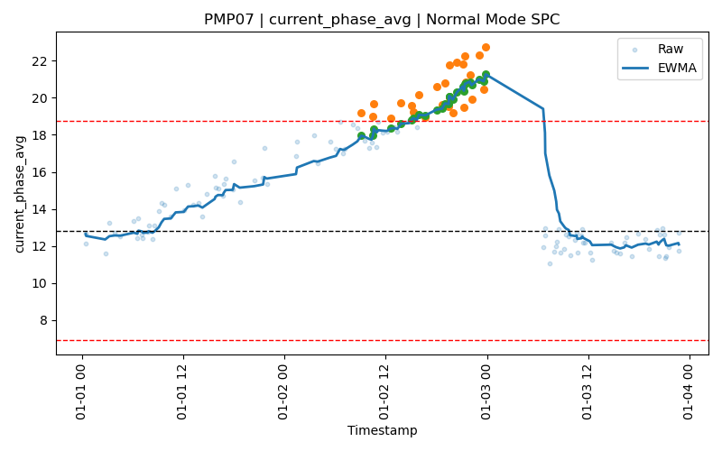

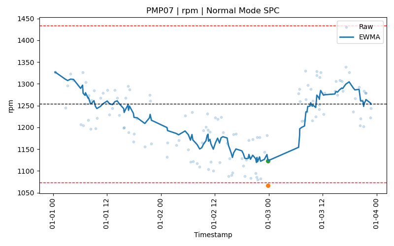

------------------------------------------------------------------------

# PMP09 had temp/current/rpm issues on Jan 12. Show temp trend last 3 days and an OOC summary table last 3 days (temp).

*Run ID: `demo_pmp09_temp_snapshot_plus_ooc_last3d`*

## JSON Plan

``` json
{
  "run_id": "demo_pmp09_temp_snapshot_plus_ooc_last3d",
  "request_text": "PMP09 had temp/current/rpm issues on Jan 12. Show temp trend last 3 days and an OOC summary table last 3 days (temp).",
  "jobs": [
    {
      "job_id": "pmp09_temp_last3d_plot_and_table",
      "sql_template": "entity_sensor_history",
      "preprocess": "ewma_spc",
      "filters": {
        "entity_group": "PMP",
        "entity": "PMP09",
        "sensor": "temperature_motor",
        "start_ts": null,
        "end_ts": null
      },
      "outputs": {
        "plots": [
          {
            "plot": "spc_time_series",
            "plot_name": "pmp09_temp_last3d.png",
            "params": {
              "window_days": 3,
              "show_raw": true
            }
          }
        ],
        "tables": [
          {
            "table": "fleet_ooc_summary",
            "table_name": "pmp09_temp_ooc_last3d.csv",
            "params": {
              "window_days": 3,
              "entities": [
                "PMP09"
              ]
            }
          }
        ]
      }
    }
  ]
}
```

## Output Artifacts

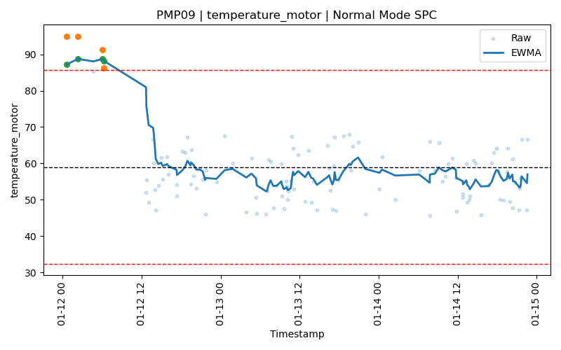

|    | entity_group   | sensor            | entity   |   total_points |   ooc_points |   percent_ooc |
|---:|:---------------|:------------------|:---------|---------------:|-------------:|--------------:|
|  0 | PMP            | temperature_motor | PMP09    |            116 |            4 |       3.44828 |

------------------------------------------------------------------------

# ARM17 vibration around Jan 3. Compare ARM fleet vibration last 7 days, then ARM17 ±3 days around Jan 3.

*Run ID: `demo_arm_vibration_fleet_then_arm17_pm_window`*

## JSON Plan

``` json
{
  "run_id": "demo_arm_vibration_fleet_then_arm17_pm_window",
  "request_text": "ARM17 vibration around Jan 3. Compare ARM fleet vibration last 7 days, then ARM17 \u00b13 days around Jan 3.",
  "jobs": [
    {
      "job_id": "arm_fleet_vibration_last7d",
      "sql_template": "fleet_sensor_history",
      "preprocess": "ewma_spc",
      "filters": {
        "entity_group": "ARM",
        "entity": null,
        "sensor": "vibration_rms",
        "start_ts": null,
        "end_ts": null
      },
      "outputs": {
        "plots": [
          {
            "plot": "fleet_time_trend",
            "plot_name": "arm_fleet_vibration_last7d.png",
            "params": {
              "window_days": 7
            }
          },
          {
            "plot": "fleet_boxplot",
            "plot_name": "arm_fleet_vibration_boxplot_last3d.png",
            "params": {
              "window_days": 3
            }
          }
        ],
        "tables": [
          {
            "table": "fleet_ooc_summary",
            "table_name": "arm_fleet_vibration_ooc_last3d.csv",
            "params": {
              "window_days": 3
            }
          }
        ]
      }
    },
    {
      "job_id": "arm17_vibration_pm_window_jan03",
      "sql_template": "entity_sensor_history",
      "preprocess": "ewma_spc",
      "filters": {
        "entity_group": "ARM",
        "entity": "ARM17",
        "sensor": "vibration_rms",
        "start_ts": null,
        "end_ts": null
      },
      "outputs": {
        "plots": [
          {
            "plot": "spc_time_series",
            "plot_name": "arm17_vibration_pm_window_jan03.png",
            "params": {
              "start_ts": "2024-01-01",
              "end_ts": "2024-01-06",
              "show_raw": true
            }
          }
        ]
      }
    }
  ]
}
```

## Output Artifacts

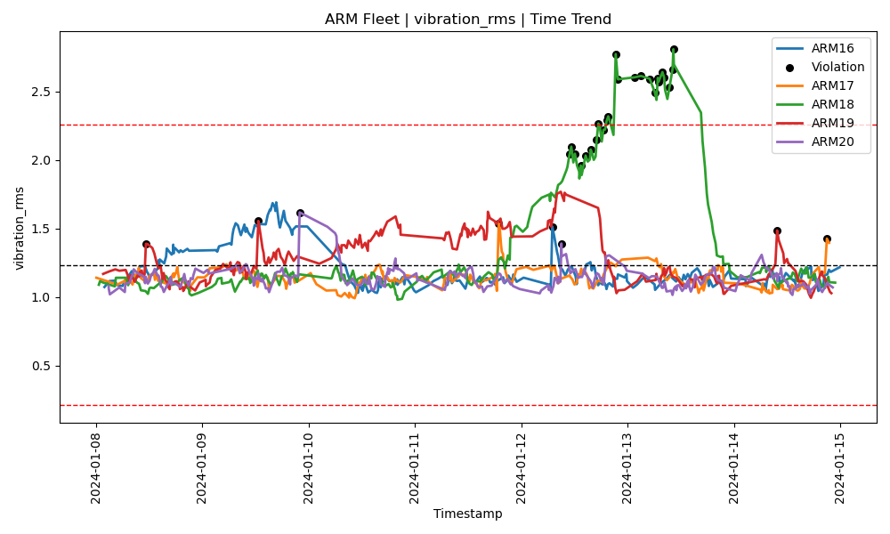

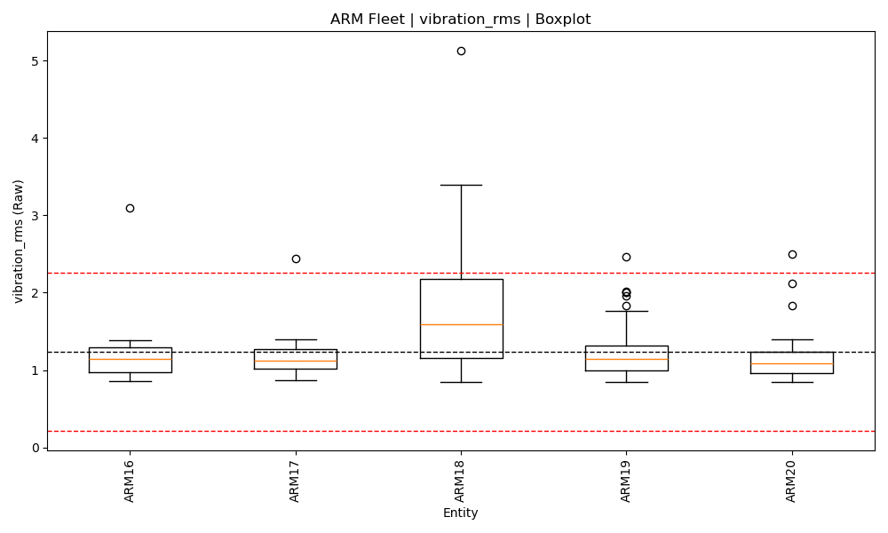

|    | entity_group   | sensor        | entity   |   total_points |   ooc_points |   percent_ooc |
|---:|:---------------|:--------------|:---------|---------------:|-------------:|--------------:|
|  0 | ARM            | vibration_rms | ARM16    |            127 |            1 |      0.787402 |
|  1 | ARM            | vibration_rms | ARM17    |            127 |            1 |      0.787402 |
|  2 | ARM            | vibration_rms | ARM18    |            113 |           24 |     21.2389   |
|  3 | ARM            | vibration_rms | ARM19    |            114 |            1 |      0.877193 |
|  4 | ARM            | vibration_rms | ARM20    |            131 |            1 |      0.763359 |

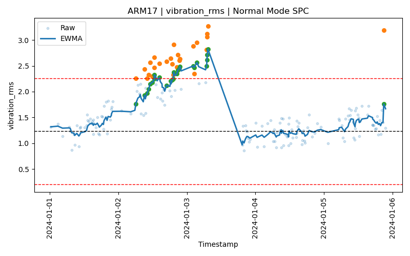

------------------------------------------------------------------------

# ARM20 had current/rpm/temp issues on Jan 6. Show last 5 days for current, rpm, and temp.

*Run ID: `demo_arm20_multi_sensor_last5d`*

## JSON Plan

``` json
{
  "run_id": "demo_arm20_multi_sensor_last5d",
  "request_text": "ARM20 had current/rpm/temp issues on Jan 6. Show last 5 days for current, rpm, and temp.",
  "jobs": [
    {
      "job_id": "arm20_current_last5d",
      "sql_template": "entity_sensor_history",
      "preprocess": "ewma_spc",
      "filters": {
        "entity_group": "ARM",
        "entity": "ARM20",
        "sensor": "current_phase_avg",
        "start_ts": null,
        "end_ts": null
      },
      "outputs": {
        "plots": [
          {
            "plot": "spc_time_series",
            "plot_name": "arm20_current_last5d.png",
            "params": {
              "window_days": 5,
              "show_raw": true
            }
          }
        ]
      }
    },
    {
      "job_id": "arm20_rpm_last5d",
      "sql_template": "entity_sensor_history",
      "preprocess": "ewma_spc",
      "filters": {
        "entity_group": "ARM",
        "entity": "ARM20",
        "sensor": "rpm",
        "start_ts": null,
        "end_ts": null
      },
      "outputs": {
        "plots": [
          {
            "plot": "spc_time_series",
            "plot_name": "arm20_rpm_last5d.png",
            "params": {
              "window_days": 5,
              "show_raw": true
            }
          }
        ]
      }
    },
    {
      "job_id": "arm20_temp_last5d",
      "sql_template": "entity_sensor_history",
      "preprocess": "ewma_spc",
      "filters": {
        "entity_group": "ARM",
        "entity": "ARM20",
        "sensor": "temperature_motor",
        "start_ts": null,
        "end_ts": null
      },
      "outputs": {
        "plots": [
          {
            "plot": "spc_time_series",
            "plot_name": "arm20_temp_last5d.png",
            "params": {
              "window_days": 5,
              "show_raw": true
            }
          }
        ]
      }
    }
  ]
}
```

## Output Artifacts

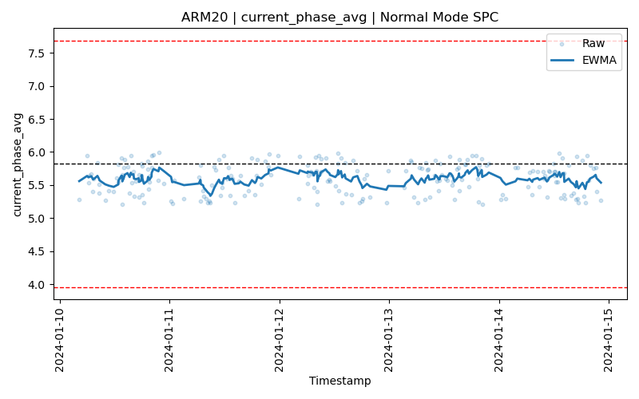

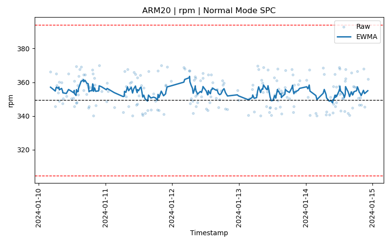

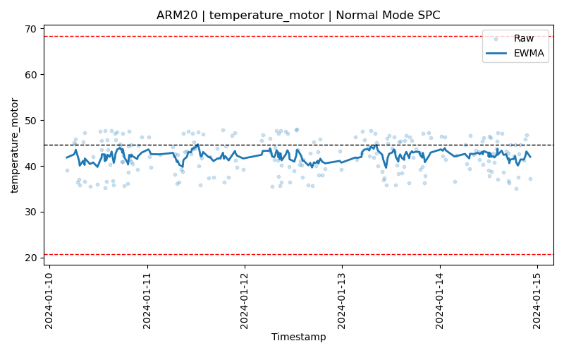

------------------------------------------------------------------------

# ARM19 issues on Jan 11 then pressure instability on Jan 12. Show pressure and temp from Jan 10--Jan 13.

*Run ID: `demo_arm19_post_pm_instability_jan10_13`*

## JSON Plan

``` json
{
  "run_id": "demo_arm19_post_pm_instability_jan10_13",
  "request_text": "ARM19 issues on Jan 11 then pressure instability on Jan 12. Show pressure and temp from Jan 10\u2013Jan 13.",
  "jobs": [
    {
      "job_id": "arm19_pressure_jan10_13",
      "sql_template": "entity_sensor_history",
      "preprocess": "ewma_spc",
      "filters": {
        "entity_group": "ARM",
        "entity": "ARM19",
        "sensor": "pressure_level",
        "start_ts": null,
        "end_ts": null
      },
      "outputs": {
        "plots": [
          {
            "plot": "spc_time_series",
            "plot_name": "arm19_pressure_jan10_13.png",
            "params": {
              "start_ts": "2024-01-10",
              "end_ts": "2024-01-13",
              "show_raw": true
            }
          }
        ]
      }
    },
    {
      "job_id": "arm19_temp_jan10_13",
      "sql_template": "entity_sensor_history",
      "preprocess": "ewma_spc",
      "filters": {
        "entity_group": "ARM",
        "entity": "ARM19",
        "sensor": "temperature_motor",
        "start_ts": null,
        "end_ts": null
      },
      "outputs": {
        "plots": [
          {
            "plot": "spc_time_series",
            "plot_name": "arm19_temp_jan10_13.png",
            "params": {
              "start_ts": "2024-01-10",
              "end_ts": "2024-01-13",
              "show_raw": true
            }
          }
        ]
      }
    }
  ]
}
```

## Output Artifacts

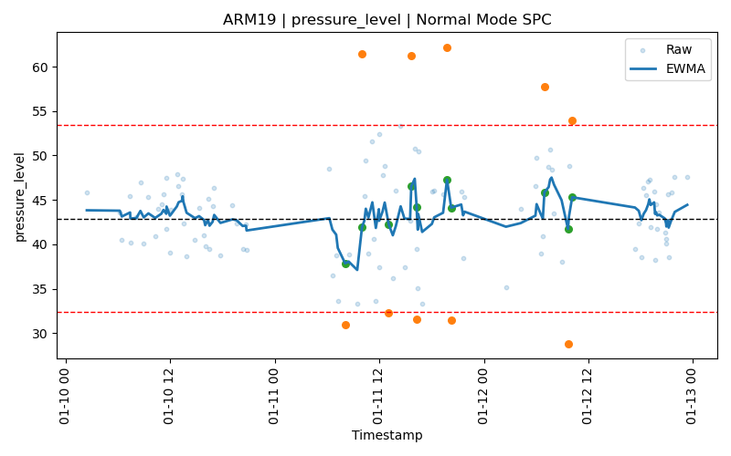

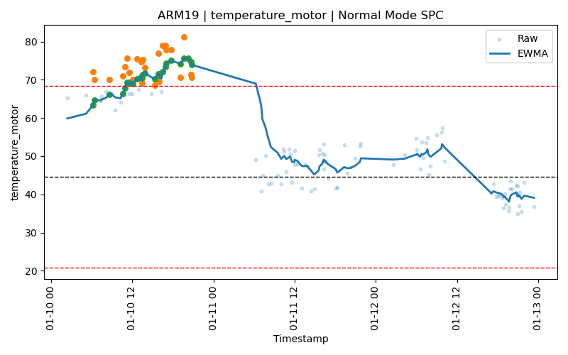

------------------------------------------------------------------------

# CPR14 had pressure instability around Jan 9. Show pressure ±2 days.

*Run ID: `demo_cpr14_pressure_pm_window_jan09_ewma_only`*

## JSON Plan

``` json
{
  "run_id": "demo_cpr14_pressure_pm_window_jan09_ewma_only",
  "request_text": "CPR14 had pressure instability around Jan 9. Show pressure \u00b12 days",
  "jobs": [
    {
      "job_id": "cpr14_pressure_jan09_pm_window",
      "sql_template": "entity_sensor_history",
      "preprocess": "ewma_spc",
      "filters": {
        "entity_group": "CPR",
        "entity": "CPR14",
        "sensor": "pressure_level",
        "start_ts": null,
        "end_ts": null
      },
      "outputs": {
        "plots": [
          {
            "plot": "spc_time_series",
            "plot_name": "cpr14_pressure_pm_window_jan09.png",
            "params": {
              "start_ts": "2024-01-07",
              "end_ts": "2024-01-11",
              "show_raw": false,
              "show_ewma": true
            }
          }
        ]
      }
    }
  ]
}
```

## Output Artifacts

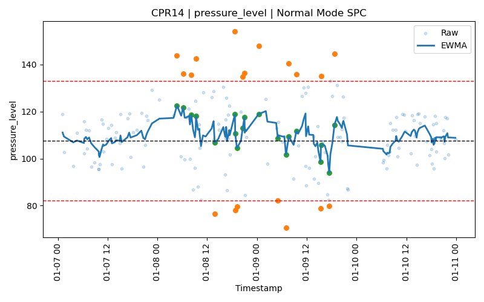

------------------------------------------------------------------------

# CPR15 had vibration on Jan 9 and pressure instability on Jan 11. Show last 7 days for vibration and pressure.

*Run ID: `demo_cpr15_vibration_and_pressure_last7d`*

## JSON Plan

``` json
{
  "run_id": "demo_cpr15_vibration_and_pressure_last7d",
  "request_text": "CPR15 had vibration on Jan 9 and pressure instability on Jan 11. Show last 7 days for vibration and pressure.",
  "jobs": [
    {
      "job_id": "cpr15_vibration_last7d",
      "sql_template": "entity_sensor_history",
      "preprocess": "ewma_spc",
      "filters": {
        "entity_group": "CPR",
        "entity": "CPR15",
        "sensor": "vibration_rms",
        "start_ts": null,
        "end_ts": null
      },
      "outputs": {
        "plots": [
          {
            "plot": "spc_time_series",
            "plot_name": "cpr15_vibration_last7d.png",
            "params": {
              "window_days": 7,
              "show_raw": true
            }
          }
        ]
      }
    },
    {
      "job_id": "cpr15_pressure_last7d",
      "sql_template": "entity_sensor_history",
      "preprocess": "ewma_spc",
      "filters": {
        "entity_group": "CPR",
        "entity": "CPR15",
        "sensor": "pressure_level",
        "start_ts": null,
        "end_ts": null
      },
      "outputs": {
        "plots": [
          {
            "plot": "spc_time_series",
            "plot_name": "cpr15_pressure_last7d.png",
            "params": {
              "window_days": 7,
              "show_raw": true
            }
          }
        ]
      }
    }
  ]
}
```

## Output Artifacts

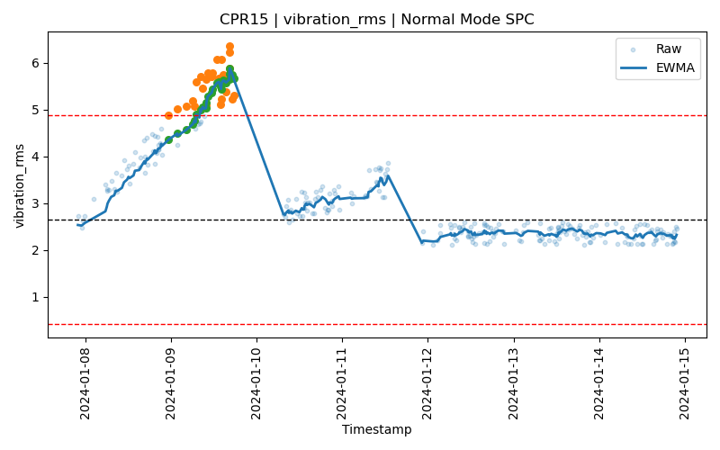

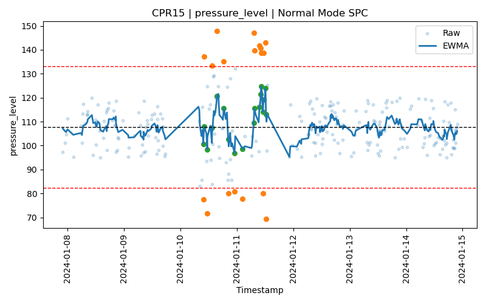

------------------------------------------------------------------------

# After CPR15 post-PM pressure instability, show CPR fleet pressure last 3 days and CPR15 separately.

*Run ID: `demo_cpr_pressure_fleet_last3d_plus_cpr15`*

## JSON Plan

``` json
{
  "run_id": "demo_cpr_pressure_fleet_last3d_plus_cpr15",
  "request_text": "After CPR15 post-PM pressure instability, show CPR fleet pressure last 3 days and CPR15 separately.",
  "jobs": [
    {
      "job_id": "cpr_fleet_pressure_last3d",
      "sql_template": "fleet_sensor_history",
      "preprocess": "ewma_spc",
      "filters": {
        "entity_group": "CPR",
        "entity": null,
        "sensor": "pressure_level",
        "start_ts": null,
        "end_ts": null
      },
      "outputs": {
        "plots": [
          {
            "plot": "fleet_time_trend",
            "plot_name": "cpr_fleet_pressure_last3d.png",
            "params": {
              "window_days": 3
            }
          },
          {
            "plot": "fleet_boxplot",
            "plot_name": "cpr_fleet_pressure_boxplot_last3d.png",
            "params": {
              "window_days": 3
            }
          }
        ],
        "tables": [
          {
            "table": "fleet_ooc_summary",
            "table_name": "cpr_fleet_pressure_ooc_last3d.csv",
            "params": {
              "window_days": 3
            }
          }
        ]
      }
    },
    {
      "job_id": "cpr15_pressure_focus_last3d",
      "sql_template": "entity_sensor_history",
      "preprocess": "ewma_spc",
      "filters": {
        "entity_group": "CPR",
        "entity": "CPR15",
        "sensor": "pressure_level",
        "start_ts": null,
        "end_ts": null
      },
      "outputs": {
        "plots": [
          {
            "plot": "spc_time_series",
            "plot_name": "cpr15_pressure_focus_last3d.png",
            "params": {
              "window_days": 3,
              "show_raw": true
            }
          }
        ]
      }
    }
  ]
}
```

## Output Artifacts

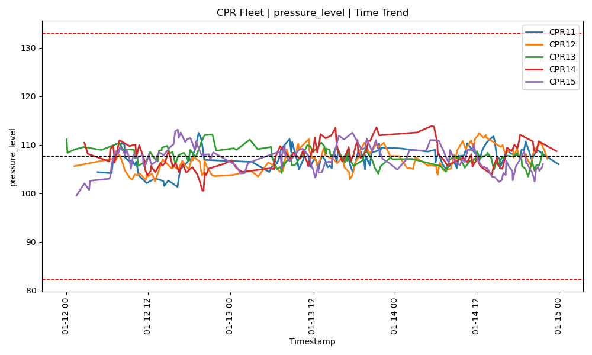

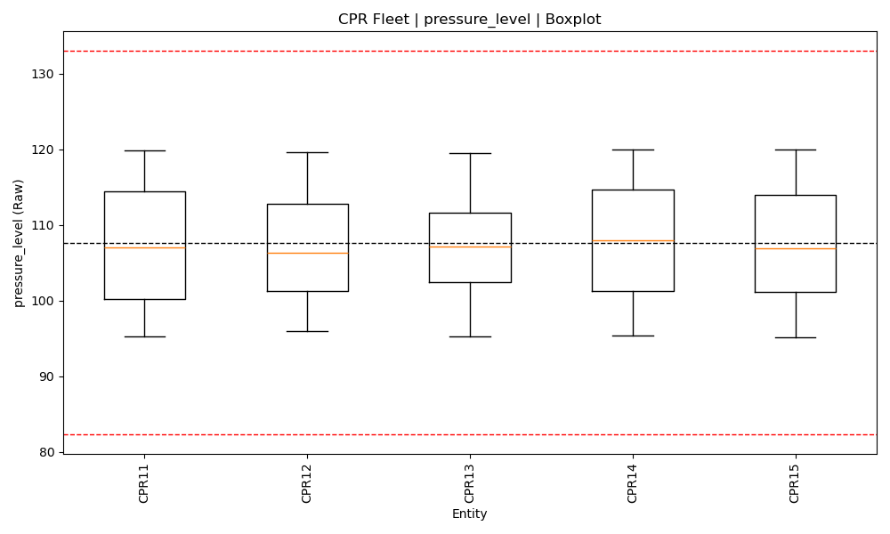

|    | entity_group   | sensor         | entity   |   total_points |   ooc_points |   percent_ooc |
|---:|:---------------|:---------------|:---------|---------------:|-------------:|--------------:|
|  0 | CPR            | pressure_level | CPR11    |            118 |            0 |             0 |
|  1 | CPR            | pressure_level | CPR12    |            124 |            0 |             0 |
|  2 | CPR            | pressure_level | CPR13    |            124 |            0 |             0 |
|  3 | CPR            | pressure_level | CPR14    |            122 |            0 |             0 |
|  4 | CPR            | pressure_level | CPR15    |            136 |            0 |             0 |

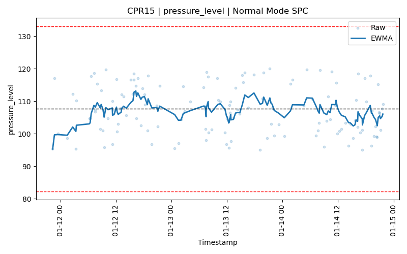

------------------------------------------------------------------------

# Replot pressure for just the bad PM cycle. 1/10-1/12.

*Run ID: `replot`*

## JSON Plan

``` json
{
  "mode": "replot",
  "run_dir": "runs/2026-02-26T20-38-03",
  "jobs": [
    {
      "job_id": "cpr15_pressure_last7d",
      "outputs": {
        "plots": [
          {
            "plot": "spc_time_series",
            "plot_name": "cpr15_pressure_bad_pm_cycle_2024_01_10_12.png",
            "params": {
              "start_ts": "2024-01-10",
              "end_ts": "2024-01-12"
            }
          }
        ]
      }
    }
  ]
}
```

## Output Artifacts

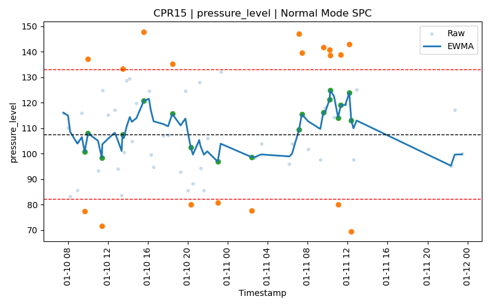

------------------------------------------------------------------------